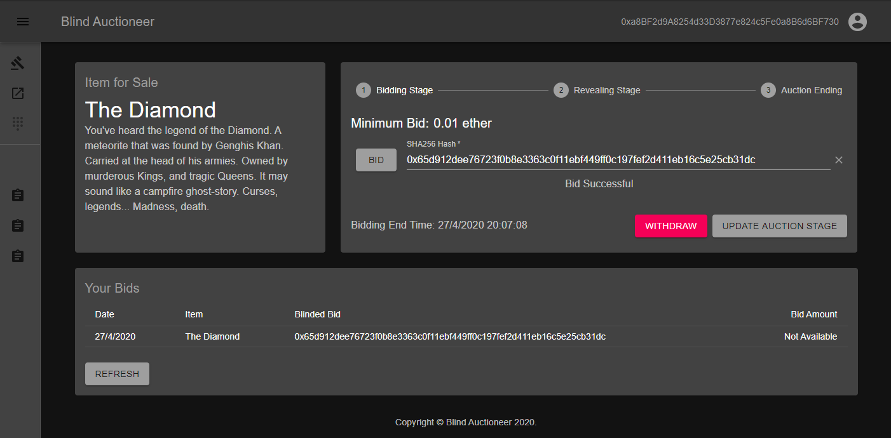

# Blind Auctioneer

A DApp that can be used to host blind auctions (school project).

A blind auction is a type of auction where all bidders submit sealed bids during the bidding stage, so that no bidder knows the bid of any other participant. In this case, a sealed bid will be the `sha256` hash of the actual bid value concatenated with a 8 byte nonce. The bidders will then reveal their bids during the reveal stage, and the highest bidder will win after this stage ends. Compared to a standard auction, a blind auction has the advantage that there is no time pressure towards the end of the bidding period.

## Getting Started

These instructions will get you a copy of the project up and running on your local machine for development and testing purposes. See deployment for notes on how to deploy the project on a live system.

### Dependencies

- [Node.js](https://nodejs.org/en/) v12.16.1
- [Ganache CLI](https://www.npmjs.com/package/ganache-cli) v6.9.1
- [Truffle Suite](https://www.trufflesuite.com/docs/truffle/getting-started/installation) v5.1.22
- [py-solc-x](https://pypi.org/project/py-solc-x/) v0.8.1

### Installing

Install NodeJS modules

```console
$ npm install
```

Install Solidity compiler

```console
$ pip3 install py-solc-x
$ python3 -m solcx.install v0.6.1
```

### Running

First, make sure ganache is running on `on 127.0.0.1:8545`. Then run it with:

```console
$ npm start
$ python3 server.py
```

## Running the tests

First, make sure ganache is running on `on 127.0.0.1:8545`. Then run the tests with:

```console
$ truffle test
```

## Features

## Preview


